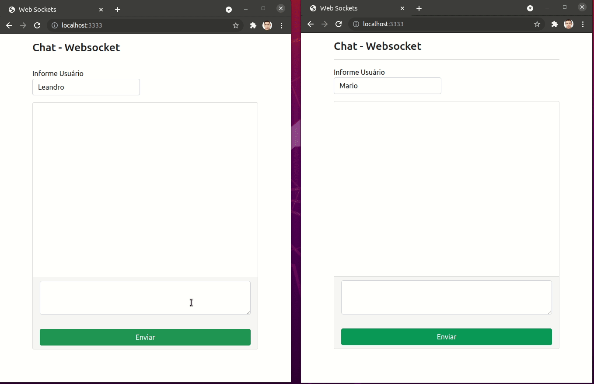

<h1 style="text-align: center; font-weight: bold;">Chat - Websocket</h1>

## Demo 📸

<div align="center" >
  
</div>

---

## Sobre o Projeto

O Projeto Chat com WebSocket foi desenvolvido para estudo sobre a Tecnologia Socket.io.

### 🛠 Tecnologias

As seguintes ferramentas foram usadas na construção do projeto:

- [NodeJS](https://nodejs.dev/)
- [Bootstrap](https://getbootstrap.com/)
- [Socket.io](https://socket.io/)

---

Antes de começar, você vai precisar ter instalado em sua máquina as seguintes ferramentas:
[Git](https://git-scm.com), [Node.js](https://nodejs.org/en/).
Além disto é bom ter um editor para trabalhar com o código como [VSCode](https://code.visualstudio.com/)

### 🎲 Rodando o App Web

```bash
# Clone este repositório
$ git clone https://github.com/leandrosuy/chatwebsocket.git

# Instale as dependências
$ npm install

# Execute a aplicação apatir da pasta Task
$ npm run dev

```

<a href="https://raw.githubusercontent.com/ARTHURPC03/Proffy-FullStack/master/github/linkedin.png">
</a>
<br />

Veja meu Linkedin: [Leandro Dantas](https://www.linkedin.com/in/leandro-dantas-1959b711b/)